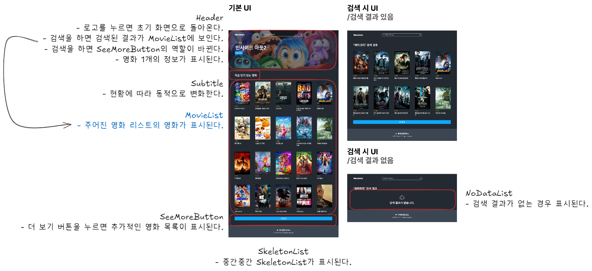
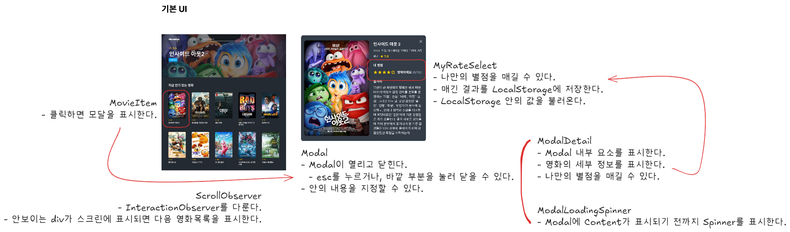

# javascript-movie-review

FE 레벨1 영화 리뷰 미션

- 접속 링크: https://minsungje.github.io/javascript-movie-review/

## 🎯 기능 요구사항

### 1단계

1. 🎬 영화 목록 조회 (인기순)

- [x] 영화 목록의 1페이지를 불러온다.
  - [x] 영화 데이터를 영화 아이템으로 표시한다.
  - [x] 영화 아이템을 담는 영화 목록을 구성한다.
  - [x] TMDB에 영화 목록 API를 요청하고 그 값을 받아온다.
  - [x] 받아온 내용으로 영화 목록 컴포넌트를 구성한다.
- [x] 더보기 버튼을 누르면 그 다음의 영화 목록을 불러 올 수 있다.
  - [x] 영화는 한 번의 요청당 20개씩 영화 목록을 보여준다.
  - [x] 단, 페이지 끝에 도달한 경우에는 더보기 버튼을 화면에 출력하지 않는다.
  - ⚠️ 인기순은 TMDB에서 제공하는 API의 속성 이름을 나타내는 것이므로 별도로 받은 데이터를 정렬하지 않습니다.
- [x] 영화 목록 아이템에 대한 Skeleton UI를 구현한다.
  - Skeleton UI는 템플릿으로 제공되는 파일 이외로 자유롭게 구현할 수 있다.

2. 🔎 검색

- [x] 영화 검색 API를 이용하여 내가 보고 싶은 영화를 검색할 수 있다.
  - [x] 검색 버튼을 클릭하여 검색할 수 있다.
  - [x] 영화 목록 조회와 같이 검색한 결과에 한해 정보를 보여주는 화면의 요구사항은 동일하다.
  - [x] 검색한 결과가 하나도 없을 경우 안내 UI를 표시한다.
  - [x] 엔터키를 눌러 검색할 수 있다.
- [x] 검색 결과에서 메인 로고를 누르면 영화 목록 조회로 돌아온다.

3. ⚠️ 오류

- [x] 오류가 발생하는 경우에는 사용자를 위한 오류 메시지를 띄워 준다.
  - [x] alert로 해당하는 오류 메세지를 띄운다.

4. UI/UX

- [x] 영화 포스터를 불러오지 못한 경우 기본 이미지를 적용한다.

5. 배포

- [x] 실행 가능한 페이지에 접근할 수 있도록 github page 기능을 이용하고, 해당 링크를 PR과 README에 작성한다.

### 2단계

1. 📺 영화 상세 정보 조회

- [ ] API에서 제공하는 항목을 활용하여 상세 정보를 보여주는 모달 창을 구현한다.
- [x] 키보드의 ESC 키를 누르면 모달 창을 닫을 수 있는 등 사용성을 고려한다.

2. ⭐️ 별점 매기기

- [ ] 사용자는 영화에 대해 별점을 줄 수 있으며 새로고침하더라도 사용자가 남긴 별점은 유지되어야 한다.
- [ ] 별점은 5개로 구성되어 있으며 한 개당 2점이며 1점 단위는 고려하지 않는다.
  - 2점: 최악이예요
  - 4점: 별로예요
  - 6점: 보통이에요
  - 8점: 재미있어요
  - 10점: 명작이에요

3. 📐 UI/UX 개선하기

- [ ] 영화 목록과 영화 상세 정보가 뜨는 모달창에 대한 반응형 레이아웃을 구성한다.
- [ ] 영화 목록에서 더보기 버튼을 눌렀을 때 페이징하는 방식에서 무한 스크롤 방식으로 변경한다.
  - 검색 결과 화면에서 사용자가 브라우저 화면의 끝에 도달하면 그 다음 20개의 목록을 서버에 요청하여 추가로 불러올 수 있다.

## 구현 목록

