# 🍿 javascript-movie-review

FE 레벨1 영화관 미션

## 배포

#### [✨ 배포 페이지 바로가기](https://badahertz52.github.io/javascript-movie-review/dist)

### 구현 모습

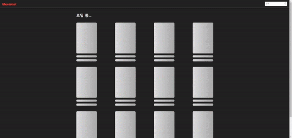

#### 2단계 추가 기능

<details>
  <summary> 그리드(반응형) </summary>
  <div markdown="1">
 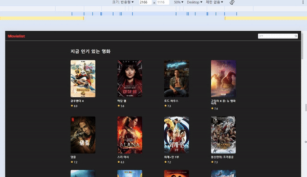
  
  </div>
</details>
<br/>

<details>
  <summary> 소형 모바일에서의 입력창 (반응형) </summary>
  <div markdown="1">
  
 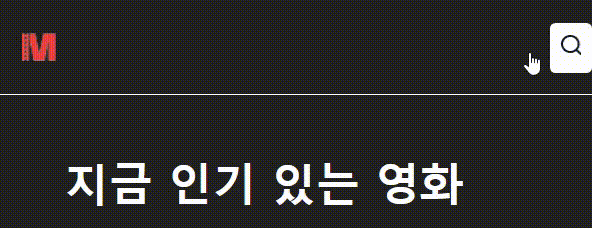
  
  </div>
</details>
<br/>
<details>
  <summary> 영화 상세 정보 모달</summary>
  <div markdown="1">
  
 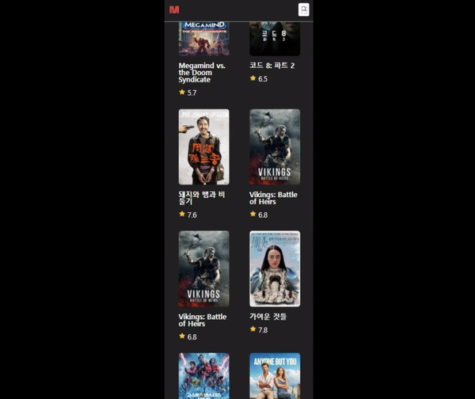
  
  </div>
</details>
<br/>

<details>
  <summary> 내 별점 </summary>
  <div markdown="1">
  
 
  
  </div>
</details>
<br/>

<details>
  <summary> 무한 스크롤</summary>
  <div markdown="1">
  
 
  
  </div>
</details>
<br/>

## 웹팩 빌드,서버 열기

```dash
// 빌드
npm run build
// 서버 열기
npm run start
```

## 테스트

```dash
// cypress
npm run test-e2e
```

## 기능 목록

<details>
  <summary>1단계</summary>
  <div markdown="1">
  
  ### 도메인 로직
  
  #### MovieListAPIClient
  
  - api 데이터 받아오기
  - 더보기 버튼 숨길지 보일지 결정
  
  #### DataStateStore
  
  - 데이터 관리
  - 스택으로 관리
  - 이전 데이터와 합쳐짐
  
  ### 영화 리스트 구현
  
  - DataStateStore의 데이터를 받아와서 영화 리스트를 보여줌
  - 스크롤: 스롤링 기능
  
  ### 영화 검색 기능
  
  #### 검색 입력창
  
  - enter 키, 검색 아이콘 클릭 시 검색 진행
  
  #### 검색 결과에 따른 영화 리스트
  
  - 검색 결과에 따라 영화 리스트와 타이틀 변경
  
  ### 더보기 버튼
  
  - api를 통해 데이터를 불어올때, 다음 검색 대상이 존재하는지 여부에 따라 더보기 버튼을 숨기거나 보여줌
  
  </div>
</details>

<details>
  <summary>2단계</summary>
  <div markdown="1">

### 영화 상세 정보 조회

- 모달창
- 모달 창 닫기
- UX 고려
- ex: esc키,백그라운드 클릭 시
- 정보 목록
  - 포스터
  - 제목
  - 장르
  - 별점
  - 설명
  - 내 별점 (별점 , 점수)
- http 오류 또는 정보 없을 경우 오류 화면

### 별점 매기기

- 위치: 영화 상세 정보 모달창
- 새로 고침 하더라도, 유저가 남긴 별점 유지 (로컬 스토리시 사용)
- 별점 클릭 해서 별점 반영
- 별점은 5개로 구성
- 별점 별, 영화 평 보여주기
  - 2점: 최악이예요
  - 4점: 별로예요
  - 6점: 보통이에요
  - 8점: 재미있어요
  - 10점: 명작이에요

### 무한 스크롤

- 더 보기 버튼이 아닌 스크롤로 영화 데이터를 불러와 리스트에 추가
- 더 이상 불러올 데이터가 없을 경우 이에 대한 컴포넌트 추가
- 더 이상 블러올 데이터가 없을 경우 api 요청 하지 않기

### 반응형

- 영화 목록
  - 데스크탑: 한 줄에 4개
  - 태블릿 : 한 줄에 3개
  - 폰: 한 줄에 2개
- 검색 입력창

  </div>
</details>

## 파일 구조

<details>
<summary> 📂 파일 구조 보기</summary>
<div markdown="1">

```
📦src
 ┣ 📂components
 ┃ ┣ 📂error
 ┃ ┃ ┣ 📜ErrorBox.ts
 ┃ ┃ ┣ 📜ErrorImg.ts
 ┃ ┃ ┣ 📜ErrorMessage.ts
 ┃ ┃ ┣ 📜ErrorView.ts
 ┃ ┃ ┣ 📜index.ts
 ┃ ┃ ┗ 📜NullElementError.ts
 ┃ ┣ 📂modal
 ┃ ┃ ┣ 📜AlertModal.ts
 ┃ ┃ ┣ 📜index.ts
 ┃ ┃ ┣ 📜ModalCloseButton.ts
 ┃ ┃ ┣ 📜ModalContainer.ts
 ┃ ┃ ┣ 📜MovieInfoModal.ts
 ┃ ┃ ┗ 📜ToastModal.ts
 ┃ ┣ 📂movie
 ┃ ┃ ┣ 📜index.ts
 ┃ ┃ ┣ 📜MovieCard.ts
 ┃ ┃ ┣ 📜MovieImg.ts
 ┃ ┃ ┣ 📜MovieItem.ts
 ┃ ┃ ┣ 📜MovieList.ts
 ┃ ┃ ┣ 📜MovieListContainer.ts
 ┃ ┃ ┣ 📜MovieListLastItem.ts
 ┃ ┃ ┣ 📜MovieListTitle.ts
 ┃ ┃ ┣ 📜MovieScore.ts
 ┃ ┃ ┣ 📜MovieTitle.ts
 ┃ ┃ ┣ 📜NoMoreMovieDataItem.ts
 ┃ ┃ ┣ 📜NoneMovieItem.ts
 ┃ ┃ ┗ 📜UserScore.ts
 ┃ ┣ 📂skeleton
 ┃ ┃ ┣ 📜index.ts
 ┃ ┃ ┣ 📜SkeletonCard.ts
 ┃ ┃ ┣ 📜SkeletonInfo.ts
 ┃ ┃ ┣ 📜SkeletonList.ts
 ┃ ┃ ┣ 📜SkeletonListContainer.ts
 ┃ ┃ ┣ 📜SkeletonMovieImg.ts
 ┃ ┃ ┣ 📜SkeletonMovieTitle.ts
 ┃ ┃ ┗ 📜SkeletonTextBox.ts
 ┃ ┣ 📜Header.ts
 ┃ ┣ 📜index.ts
 ┃ ┣ 📜Label.ts
 ┃ ┣ 📜RefreshButton.ts
 ┃ ┗ 📜SearchBox.ts
 ┣ 📂constants
 ┃ ┣ 📜component.ts
 ┃ ┣ 📜errorMessage.ts
 ┃ ┣ 📜index.ts
 ┃ ┗ 📜system.ts
 ┣ 📂controller
 ┃ ┣ 📜AlertModalForNullController.ts
 ┃ ┣ 📜ErrorViewController.ts
 ┃ ┣ 📜index.ts
 ┃ ┣ 📜ModalContainerController.ts
 ┃ ┣ 📜ScrollController.ts
 ┃ ┣ 📜ScrollObserver.ts
 ┃ ┣ 📜SearchBoxResponsiveHandler.ts
 ┃ ┣ 📜SkeletonController.ts
 ┃ ┗ 📜WindowResponsiveHandler.ts
 ┣ 📂images
 ┃ ┣ 📜circle-exclamation.svg
 ┃ ┣ 📜logo.png
 ┃ ┣ 📜logo_small.png
 ┃ ┣ 📜no_image.svg
 ┃ ┣ 📜no_movie.svg
 ┃ ┣ 📜search_button.png
 ┃ ┣ 📜star_empty.png
 ┃ ┣ 📜star_filled.png
 ┃ ┣ 📜tape.svg
 ┃ ┣ 📜trash.svg
 ┃ ┣ 📜triangle_exclamation.svg
 ┃ ┗ 📜xmark.svg
 ┣ 📂model
 ┃ ┣ 📜APIClient.ts
 ┃ ┣ 📜DataFetcher.ts
 ┃ ┣ 📜DataStateStore.ts
 ┃ ┣ 📜index.ts
 ┃ ┗ 📜LocalStorageHandler.ts
 ┣ 📂styles
 ┃ ┣ 📜common.css
 ┃ ┣ 📜error.css
 ┃ ┣ 📜header.css
 ┃ ┣ 📜modal.css
 ┃ ┣ 📜movie-info-modal.css
 ┃ ┣ 📜movie-list.css
 ┃ ┣ 📜refresh-button.css
 ┃ ┣ 📜reset.css
 ┃ ┣ 📜search-box.css
 ┃ ┣ 📜skeleton.css
 ┃ ┗ 📜style-constants.css
 ┣ 📂type
 ┃ ┣ 📜global.d.ts
 ┃ ┗ 📜movie.ts
 ┣ 📂utils
 ┃ ┣ 📜checkElementIsNotNull.ts
 ┃ ┣ 📜createElementWithAttribute.ts
 ┃ ┣ 📜debouneFunc.ts
 ┃ ┣ 📜handleFetchData.ts
 ┃ ┗ 📜index.ts
 ┣ 📜app.ts
 ┣ 📜config.ts
 ┗ 📜index.js
```

</div>
</details>

## 모듈 구조 및 프로세스

<details>
  <summary>🔍 모듈 구조 보기</summary>
  <div markdown="1">
  <br/>
  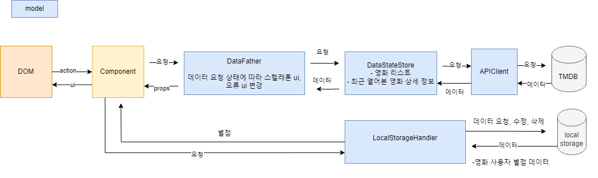
  </div>
</details>
<br/>

<details>
  <summary>🔍 미션 1단계 프로세스 보기</summary>
  <div markdown="1">
  <br/>
  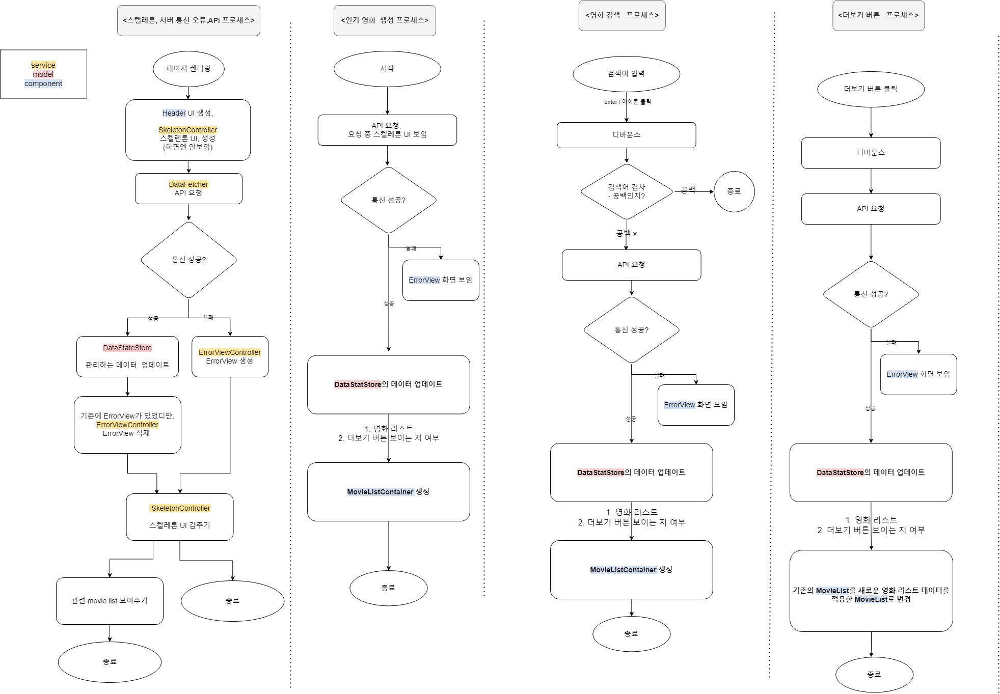
  </div>
</details>
<br/>

<details>
  <summary>🔍 미션 2단계 무한 스크롤 프로세스 보기</summary>
  <div markdown="1">
  <br/>
  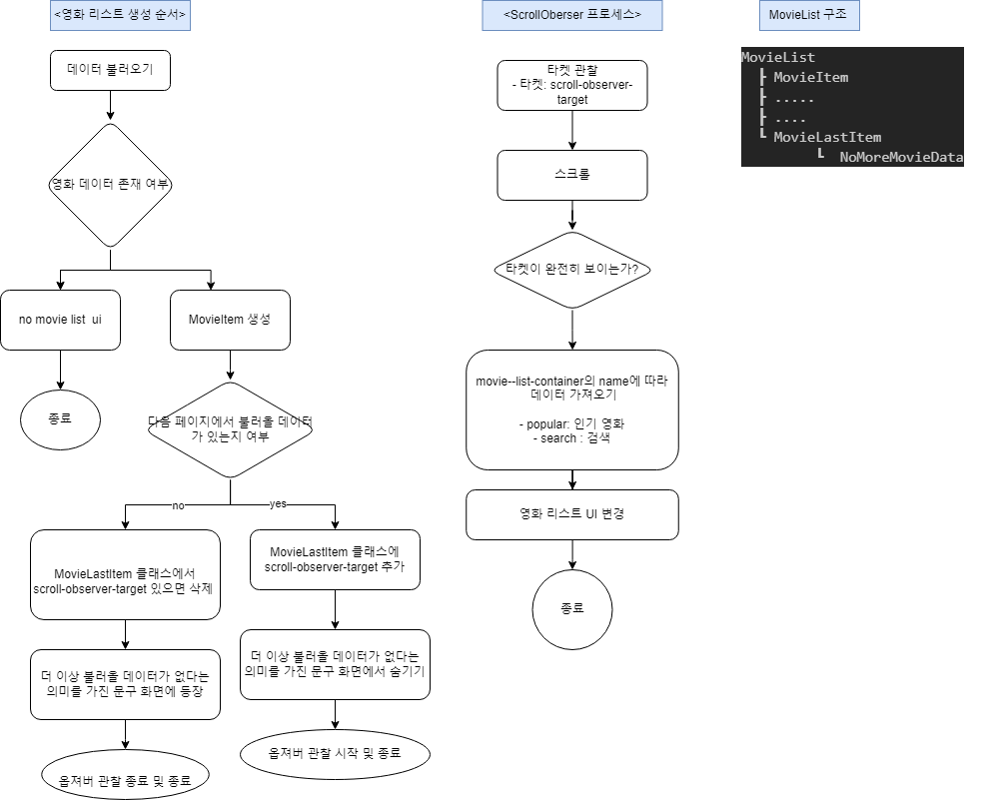
  </div>
</details>

## 오류 화면

<details>
  <summary> 🔍 영화 리스트 401오류 화면 보기</summary>
  <div markdown="401">
  <br/>
  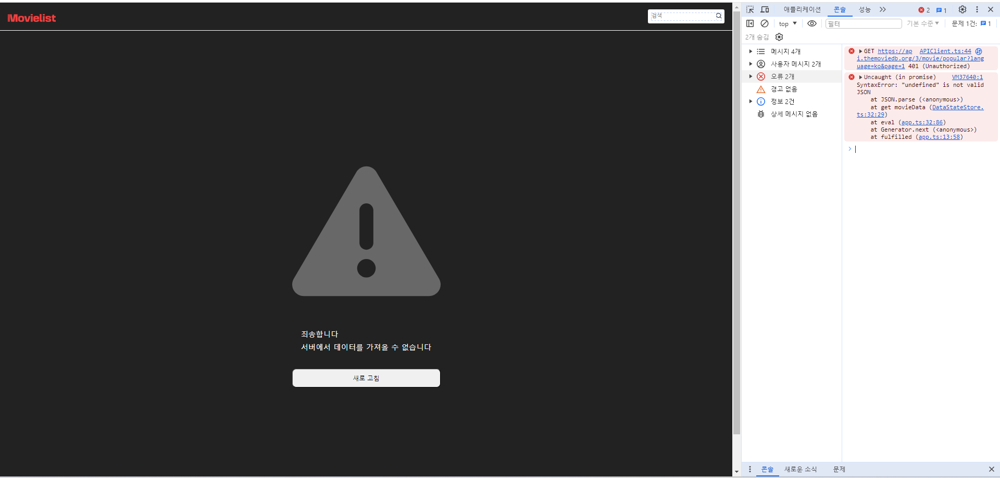
  </div>
</details>

<br/>

<details>
  <summary> 🔍 영화 상세 정보 모달 401오류 화면 보기</summary>
  <div markdown="401">
  <br/>
  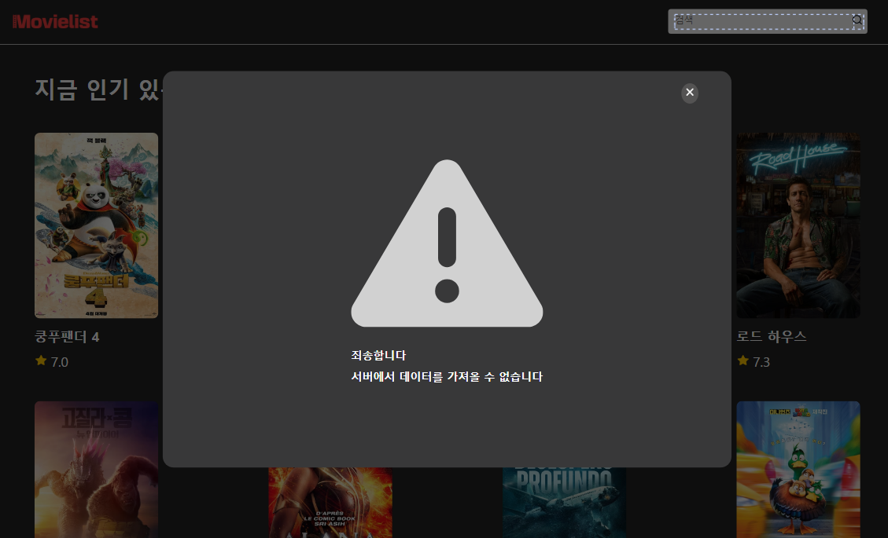
  </div>
</details>
<br/>
<details>
  <summary>🔍영화 리스트 404오류 화면 보기</summary>
  <div markdown="404">
  <br/>
  
  </div>
</details>

<br/>
<details>
  <summary>🔍 영화 상세 정보 모달 404오류 화면 보기</summary>
  <div markdown="404">
  <br/>
  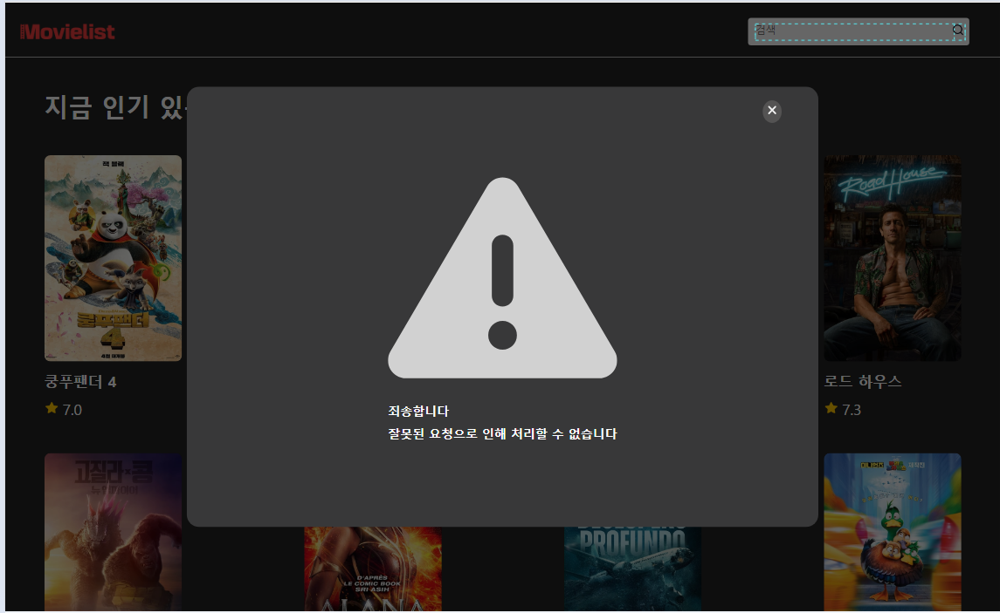
  </div>
</details>
<br/>
<details>
  <summary> 🔍204 지만, 잘못된 url로 인한 json 형태 오류</summary>
  <div markdown="204">
  <br/>
  <div>  데이터 통신을 성공했지만, url이 잘못되어 response를 json형태로 변형하지 못할 때 오류 화면
  </div>
  <br/>
  
  </div>
</details>

<br/>

<details>
  <summary> 🔍찾는 element가 null인 경우</summary>
  <div markdown="alert">
  <br/>
    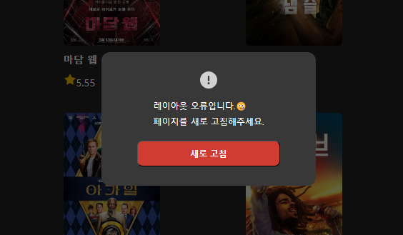
  </div>
</details>

<br/>

<details>
  <summary> 🔍검색창에 입력값이 없거나 공백으로 이루어진 경우</summary>
  <div markdown="alert">
  <br/>
    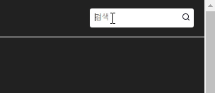
  </div>
</details>
