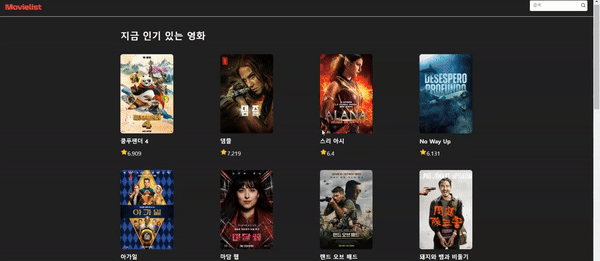
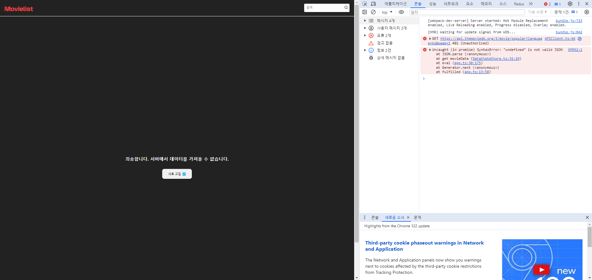
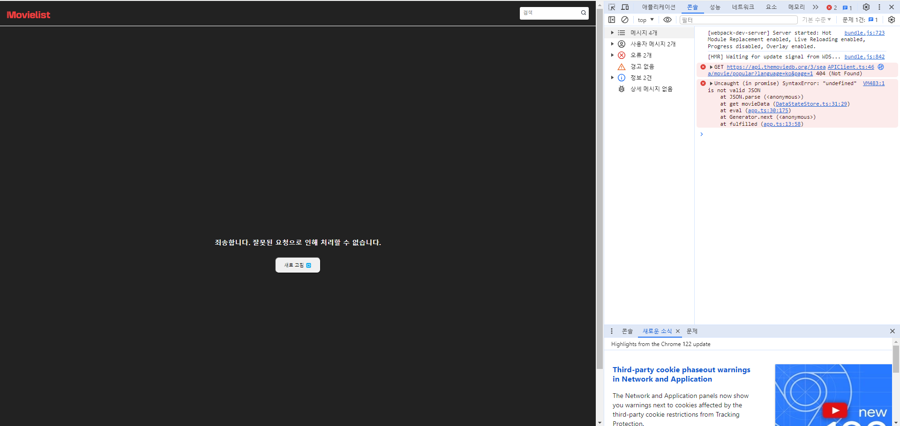
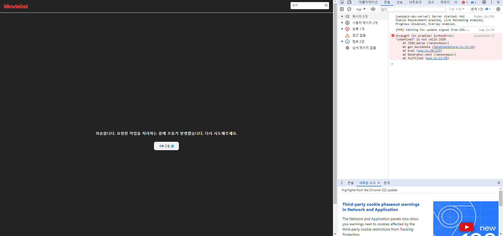
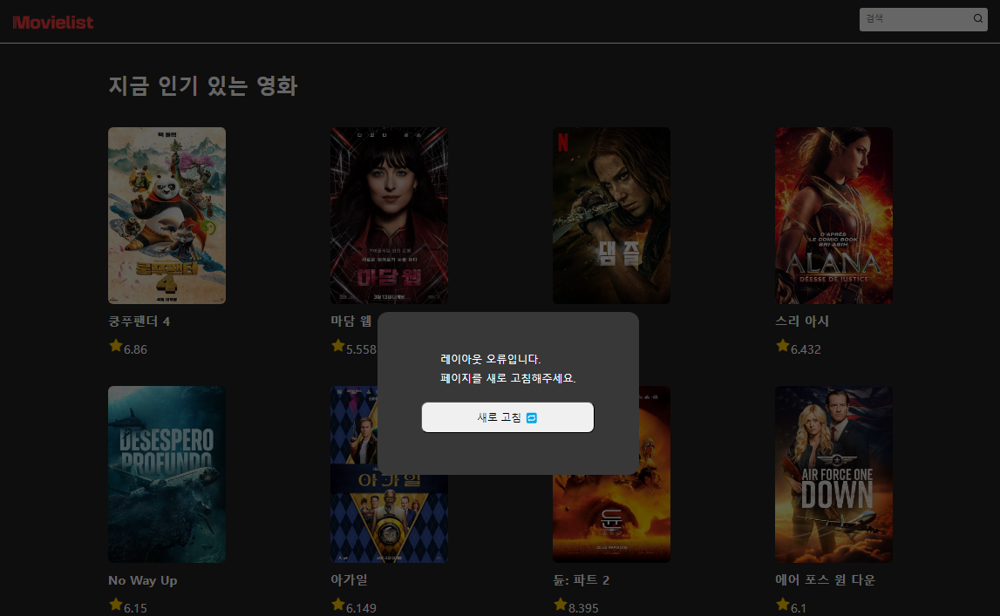

# javascript-movie-review

FE 레벨1 영화관 미션

## 배포

#### [✨ 배포 페이지 바로가기](https://badahertz52.github.io/javascript-movie-review/dist)

### 구현 모습



## 웹팩 빌드,서버 열기

```dash
// 빌드
npm run build
// 서버 열기
npm run start
```

## 테스트

```dash
// cypress
npm run test-e2e
```

## 기능 목록

### 도메인 로직

#### APIClient

- api 데이터 받아오기
- 더보기 버튼 숨길지 보일지 결정

#### DataStateStore

- 데이터 관리
- 스택으로 관리
- 이전 데이터와 합쳐짐

### 영화 리스트 구현

- DataStateStore의 데이터를 받아와서 영화 리스트를 보여줌
- 스크롤: 스롤링 기능

### 영화 검색 기능

#### 검색 입력창

- enter 키, 검색 아이콘 클릭 시 검색 진행

#### 검색 결과에 따른 영화 리스트

- 검색 결과에 따라 영화 리스트와 타이틀 변경

### 더보기 버튼

- api를 통해 데이터를 불어올때, 다음 검색 대상이 존재하는지 여부에 따라 더보기 버튼을 숨기거나 보여줌

## 파일 구조

<details>
<summary>파일 구조 보기</summary>
<div markdown="1">

```
📦src
 ┣ 📂components
 ┃ ┣ 📂modal
 ┃ ┃ ┣ 📜AlertModal.ts
 ┃ ┃ ┗ 📜ModalContainer.ts
 ┃ ┣ 📂skeleton
 ┃ ┃ ┣ 📜SkeletonCard.ts
 ┃ ┃ ┣ 📜SkeletonList.ts
 ┃ ┃ ┗ 📜SkeletonListContainer.ts
 ┃ ┣ 📜ErrorView.ts
 ┃ ┣ 📜Header.ts
 ┃ ┣ 📜Label.ts
 ┃ ┣ 📜MoreButton.ts
 ┃ ┣ 📜MovieCard.ts
 ┃ ┣ 📜MovieImg.ts
 ┃ ┣ 📜MovieItem.ts
 ┃ ┣ 📜MovieList.ts
 ┃ ┣ 📜MovieListContainer.ts
 ┃ ┣ 📜MovieListTitle.ts
 ┃ ┣ 📜MovieScore.ts
 ┃ ┣ 📜MovieTitle.ts
 ┃ ┣ 📜NoneMovieItem.ts
 ┃ ┣ 📜RefreshButton.ts
 ┃ ┗ 📜SearchBox.ts
 ┣ 📂constants
 ┃ ┣ 📜apiErrorMessage.ts
 ┃ ┣ 📜index.ts
 ┃ ┗ 📜system.ts
 ┣ 📂model
 ┃ ┣ 📜APIClient.ts
 ┃ ┣ 📜DataStateStore.ts
 ┃ ┗ 📜index.ts
 ┣ 📂service
 ┃ ┣ 📜AlertModalForNullEl.ts
 ┃ ┣ 📜DataFetcher.ts
 ┃ ┣ 📜ErrorViewController.ts
 ┃ ┗ 📜SkeletonController.ts
 ┣ 📂styles
 ┃ ┣ 📜common.css
 ┃ ┣ 📜error-view.css
 ┃ ┣ 📜header.css
 ┃ ┣ 📜modal.css
 ┃ ┣ 📜more-button.css
 ┃ ┣ 📜movie-list.css
 ┃ ┣ 📜refresh-button.css
 ┃ ┣ 📜reset.css
 ┃ ┣ 📜search-box.css
 ┃ ┣ 📜skeleton.css
 ┃ ┗ 📜style-constants.css
 ┣ 📂type
 ┃ ┣ 📜global.d.ts
 ┃ ┗ 📜movie.ts
 ┣ 📂utils
 ┃ ┣ 📜createElementWithAttribute.ts
 ┃ ┣ 📜debouneFunc.ts
 ┃ ┗ 📜index.ts
 ┣ 📜app.ts
 ┣ 📜config.ts
 ┗ 📜index.js
```

</div>
</details>

## 모듈 구조 및 프로세스

<details>
<summary>🔍 모듈 구조 보기</summary>
<div markdown="1">


</div>
</details>

<details>
<summary>🔍 미션 1단계 프로세스 보기</summary>
<div markdown="1">


</div>
</details>

## 오류 화면

<details>
<summary> 🔍 401오류 화면 보기</summary>
<div markdown="401">


</div>
</details>
<br/>

<details>
<summary>🔍404오류 화면 보기</summary>
<div markdown="404">


</div>
</details>
<br/>

<details>
<summary> 🔍204 지만, 잘못된 url로 인한 json 형태 오류</summary>
<div markdown="204">
<div>  데이터 통신을 성공했지만, url이 잘못되어 response를 json형태로 변형하지 못할 때 오류 화면
</div>

</div>
</details>
<br/>

<details>
<summary> 🔍찾는 element가 null인 경우</summary>
<div markdown="alert">
  
</div>
</details>
