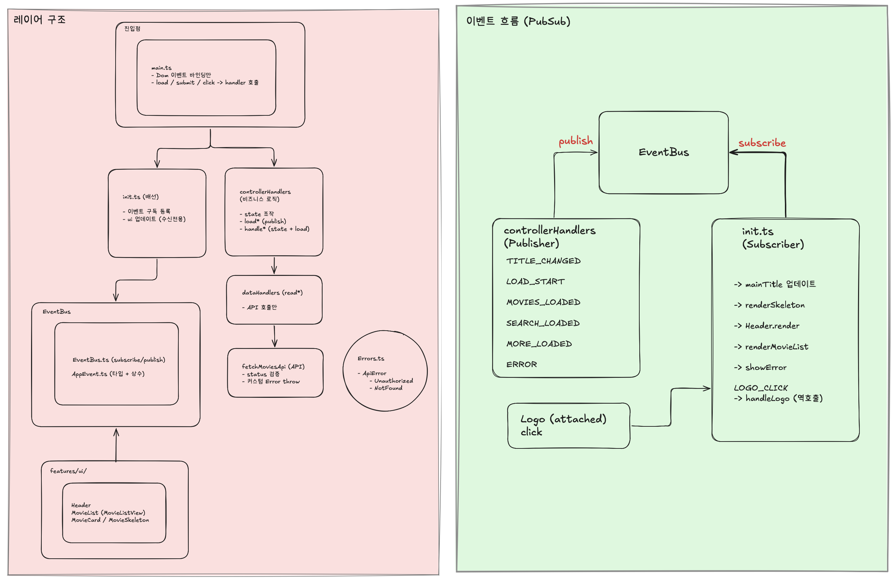

# javascript-movie-review

FE 레벨1 영화 리뷰 미션

## 공통 요구사항

1. 영화 목록 조회 (인기순)

- [x] 영화 목록의 1페이지를 불러오며 더보기 버튼을 누르면 그 다음의 영화 목록을 불러 올 수 있다.
- [x] 페이지 끝에 도달한 경우에는 더보기 버튼을 화면에 출력하지 않는다.
- [x] 영화는 한 번의 요청당 20개씩 영화 목록을 보여준다.
- [x] 영화 목록을 불러오는 동안 Skeleton UI 를 보여준다
- [x] Skeleton UI는 템플릿으로 제공되는 파일 이외로 자유롭게 구현할 수 있다.

2. 검색

- [x] 영화 검색 API를 이용하여 내가 보고 싶은 영화를 검색할 수 있다.
- [x] 엔터키를 눌러 검색할 수 있다
- [x] 검색 버튼을 클릭하여 검색할 수 있다
- [x] 영화 목록 조회와 같이 검색한 결과에 한해 정보를 보여주는 화면의 요구사항은 동일하다

3. 오류

- [x] 오류가 발생하는 경우에는 사용자를 위한 오류 메시지를 띄워 준다.
- [x] 어떤 오류를 대응해야 하고, 어떤 UI로 보여줄 것인지는 자율적으로 결정한다.

4. UI

- [x] 다음의 Figma 시안을 기준으로 구현한다.

5. 배포

- [x] 실행 가능한 페이지에 접근할 수 있도록 github page 기능을 이용하고, 해당 링크를 PR과 README에 작성한다.

## 기능 목록

### 1. 기본 UI

- 불러온 영화 목록은 한 행에 5개씩 보여준다.
- 영화 카드에 포스터, 별점, 제목 순으로 표시한다.
- 더보기 버튼 클릭시 다음 페이지 영화 20개를 기존 목록 아래에 추가한다.
- 마지막 페이지면, "더보기" 버튼을 숨긴다.

#### 검색 시 UI

##### 검색 결과가 있을 시

- 검색 결과를 영화 목록에 표시하고, 섹션 제목을 "검색어" 검색 결과로 표시한다.

##### 검색 결과가 없을 시

- 검색 결과가 없으면 "검색 결과가 없습니다" 를 표시한다.

#### 로딩 UI

- API 호출 중 스켈레톤 UI를 표시한다.
- 응답이 오면 스켈레톤을 실제 데이터로 교체한다.

#### 예외 처리

- API 호출 오류 시 오류 메시지를 화면에 출력한다.

### 2. 이벤트 처리

- TMDB API에서 인기 영화 목록을 가져온다.
- 엔터키와 검색 버튼을 이용하여 검색할 수 있다.
- 검색어를 지우면 인기 영화 목록으로 복귀한다.

---

## 아키텍처



### 레이어 구조

```
main.ts                    DOM 이벤트 바인딩만
  ├─ init.ts               EventBus 구독 등록 + UI 업데이트
  └─ controllerHandlers    state 조작 + 이벤트 publish
       └─ dataHandlers     API 호출 (read*)
            └─ fetchMoviesApi   fetch + status 검증 + 커스텀 에러 throw
                 └─ errors.ts   ApiError / UnauthorizedError / NotFoundError

pubsub/
  ├─ EventBus.ts           subscribe / publish 메커니즘
  └─ AppEvents.ts          이벤트 상수 + payload 타입 매핑

features/ui/               컴포넌트 (Header, MovieList, MovieCard, MovieSkeleton)
state.ts                   매 호출마다 바뀌는 값 (page, searchQuery)
```

### 전체 플로우

진입점은 가장 먼저 EventBus 구독 설정 함수를 호출해 모든 구독자를 등록한다. 이 단계를 거쳐야 이후 발행되는 이벤트가 구독자에게 전달될 수 있다. 이후 진입점은 DOM 이벤트(load / submit / click)만 바인딩하고, 각 이벤트는 컨트롤러의 핸들러를 호출한다.

컨트롤러는 상태를 조작하고 로드 함수를 호출한다. 로드 함수는 항상 같은 순서로 동작한다 — 타이틀 변경 이벤트를 발행하고, 로딩 시작 이벤트를 발행한 뒤, 데이터 레이어를 통해 API를 호출하고, 응답이 오면 데이터 로드 완료 이벤트를 발행한다. 더보기 흐름만 예외적으로 화면을 새로 그리지 않으므로 타이틀 변경과 로딩 시작 이벤트를 생략한다.

구독 레이어는 각 이벤트를 받아 헤더와 영화 목록을 렌더링하고, 더보기 버튼의 표시 여부를 결정합니다. 검색 결과가 비어 있으면 "검색 결과 없음" UI를, API 에러가 발생하면 에러 메시지를 화면에 표시한다.

API 레이어는 `response.ok`가 false일 때 status에 따라 적절한 커스텀 에러를 던진다. 데이터 레이어는 에러를 가로채지 않고 그대로 위로 전파하며, 컨트롤러가 비로소 try/catch로 잡아 에러 이벤트를 발행한다. 에러의 원본 타입이 컨트롤러까지 살아 있어 향후 `instanceof`로 분기 확장이 가능하다.
