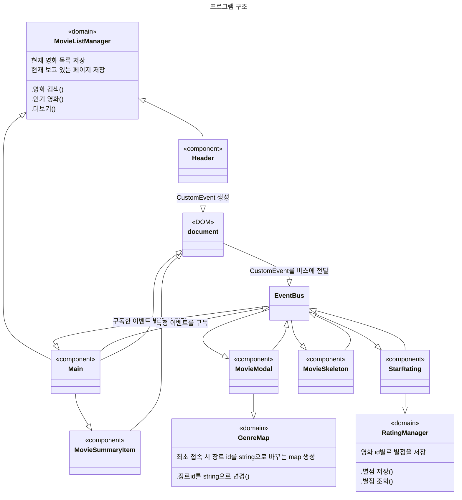

```mermaid

---
title: 프로그램 구조
---
classDiagram
  MovieListManager <|-- Header
  MovieListManager <|-- Main
  Main --|> MovieSummaryItem
  document --|> EventBus : CustomEvent를 버스에 전달
  EventBus --|> Main : 구독한 이벤트 발생 시 전달
  Main --|> EventBus : 특정 이벤트를 구독
  Header --|> document : CustomEvent 생성
  MovieSummaryItem --|> document
  EventBus --|> MovieModal
  MovieModal --|> EventBus
  StarRating --|> RatingManager
  StarRating --|> EventBus
  EventBus --|> StarRating
  Main --|> document
  MovieSkeleton --|> EventBus
  EventBus --|> MovieSkeleton
  MovieModal --|> GenreMap

  class GenreMap {
    <<domain>>
    최초 접속 시 장르 id를 string으로 바꾸는 map 생성

    .장르id를 string으로 변경()
  }

  class StarRating {
    <<component>>
  }

  class RatingManager {
    <<domain>>

    영화 id별로 별점을 저장

    .별점 저장()
    .별점 조회()
  }

  class MovieModal {
    <<component>>
  } 

  class MovieListManager {
    <<domain>>

    현재 영화 목록 저장
    현재 보고 있는 페이지 저장

    .영화 검색()
    .인기 영화()
    .더보기()
  }

  class Main {
    <<component>>
  }

  class Header {
    <<component>>
  }

  class document {
    <<DOM>>
  }

  class MovieSkeleton {
    <<component>>
  }

  class MovieSummaryItem {
    <<component>>
  }
```
