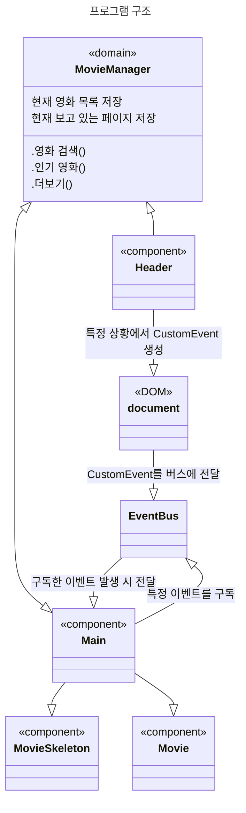

```mermaid

---
title: 프로그램 구조
---
classDiagram
  MovieManager <|-- Header
  MovieManager <|--|> Main
  Main --|> MovieSkeleton
  Main --|> Movie
  document --|> EventBus : CustomEvent를 버스에 전달
  EventBus --|> Main : 구독한 이벤트 발생 시 전달
  Main --|> EventBus : 특정 이벤트를 구독
  Header --|> document : 특정 상황에서 CustomEvent 생성

  class MovieManager {
    <<domain>>

    현재 영화 목록 저장
    현재 보고 있는 페이지 저장

    .영화 검색()
    .인기 영화()
    .더보기()
  }

  class Main {
    <<component>>
  }

  class Header {
    <<component>>
  }

  class document {
    <<DOM>>
  }

  class MovieSkeleton {
    <<component>>
  }

  class Movie {
    <<component>>
  }
```
